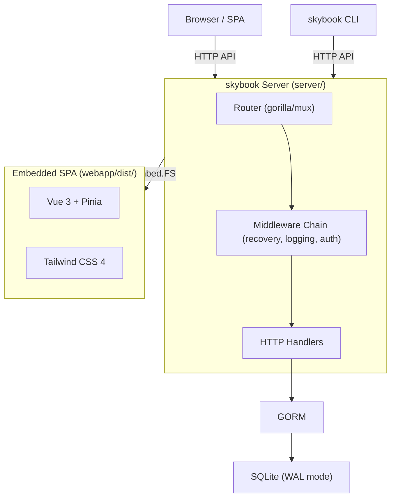
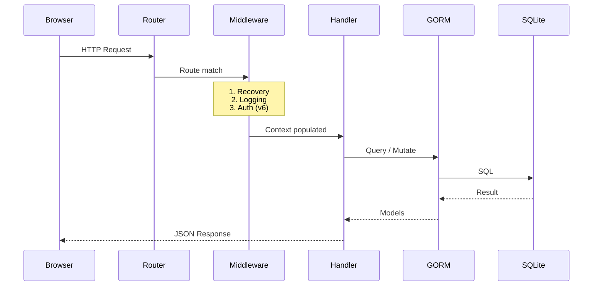

# Architecture — SkyBook (System-Wide)

> System-wide architecture, package layering, data model, and API reference.
> For sub-component details, see the scoped ARCHITECTURE.md in [server/](server/ARCHITECTURE.md) and [webapp/](webapp/ARCHITECTURE.md).
> See [AGENTS.md](AGENTS.md) for quick-start agent context.

---

## System Overview

SkyBook is a self-hosted skydive logbook that ships as a **single Go binary** with an embedded Vue 3 SPA.

| Component | Location | Purpose |
|-----------|----------|---------|
| **Server** (`skybook`) | `server/` | Go HTTP server — REST API, middleware chain, SQLite via GORM |
| **Webapp** | `webapp/` | Vue 3 + Vite 7 + Tailwind CSS 4 SPA, embedded in server binary |
| **Config** | `server/skybook.cfg` | TOML configuration with `SKYBOOK_` env var overrides |

### Core Abstractions

| Type | Package | Description |
|------|---------|-------------|
| `Jump` | `server/common` | Skydive jump with sequential numbering, discipline, location, equipment |
| `BaseJump` | `server/common` | BASE jump with independent numbering, object type, slider config |
| `TunnelSession` | `server/common` | Wind tunnel session with duration, cumulative time tracking |
| `JumpBuddy` | `server/common` | Shared buddy pool across all activity types (many-to-many) |
| `Document` | `server/common` | Uploaded file metadata (license, insurance, rig check) |
| `User` | `server/common` | User account — anonymous (v1) or Google OAuth (v6) |

---

## High-Level Architecture



---

## Package Layering

Dependency direction flows left to right. Packages only import from packages to their left.

```
common → metadata → middleware → handlers → cmd → server
```

| Package | Location | Purpose |
|---------|----------|---------|
| `common` | `server/common/` | Shared types (Jump, User, Document), config struct, validation, `WriteJSON`/`WriteError` helpers |
| `metadata` | `server/metadata/` | GORM/SQLite backend, gormigrate migrations, queries, numbering invariant |
| `middleware` | `server/middleware/` | `Recovery`, `Logging`, `RequestID`; auth (v6), pagination |
| `handlers` | `server/handlers/` | HTTP handlers — health, config, jump CRUD, documents, stats |
| `cmd` | `server/cmd/` | Cobra CLI: `root.go` (`--config` flag, default serve), `serve.go` |
| `server` | `server/server/` | `SkyBookServer`: router, middleware chain, graceful shutdown, SPA serving |

> [!IMPORTANT]
> Never import in the reverse direction. If `handlers` needs a type, it must be defined in `common`.

---

## Request Lifecycle



---

## Data Model

### Jump (v1)

The core entity. All fields are defined in [PRD §3.1](plans/PRD.md).

| Key Field | Type | Notes |
|-----------|------|-------|
| `ID` | `uint` (PK) | Auto-increment |
| `Number` | `uint` | Sequential, contiguous, per-user. **Subject to renumbering.** |
| `UserID` | `uint` (FK) | Multi-tenant readiness — defaults to anonymous user (ID=1) in v1 |
| `Date` | `DateOnly` | API sends/receives `YYYY-MM-DD`. DB stores full `time.Time`; seconds encode intra-day ordering. |
| `Dropzone` | `string` | Required, autocomplete from history |
| `JumpType` | `string` | Enum: FF, FS, CRW, HOP, CF, AFF, AFFI, CAMERA, TANDEM, DEMO, XRW, ANGLE, TRACKING, CP, WINGSUIT, OTHER |
| `Links` | `JSON text` | Array of URLs, stored as JSON |
| `Buddies` | `[]JumpBuddy` | Many-to-many via `jump_buddies` join table (v4) |

#### Date handling

- **`DateOnly` type** (`common/date.go`): wraps `time.Time`, marshals as `"YYYY-MM-DD"`, accepts both `YYYY-MM-DD` and RFC3339 (time stripped). Stored as midnight UTC.
- **Date validation**: `date(N) ≤ date(N+1)` enforced in the metadata layer (`validateDateOrder`) on create, insert, and update. Returns descriptive error messages. Ordering is always by `Number` — date is informational.

### BaseJump (v9) & TunnelSession (v10)

Separate tables with independent numbering sequences. Same renumbering invariant applies. Full schemas in [PRD §3.3–3.4](plans/PRD.md).

### JumpBuddy (v4)

Shared pool across all activity types. Linked via join tables: `jump_buddies`, `base_jump_buddies`, `tunnel_session_buddies`. Autocomplete ranked by popularity (total jump count across all types).

### Document (v3)

File metadata stored in DB, file content on disk at configurable path. Categories: LICENSE, INSURANCE, RIG_CHECK, MEDICAL, AAD, RESERVE_REPACK, OTHER.

### User (v1 anonymous → v6 multi-tenant)

In v1, an anonymous user (ID=1) is auto-created. All data is attributed to this user. When v6 adds Google OAuth, no schema changes are needed.

---

## Jump Number Invariant

> [!CAUTION]
> This is the most critical business rule in the system. All sequential tables (jumps, BASE jumps, tunnel sessions) follow this invariant.

**Rule**: Jump numbers form a **contiguous 1-based sequence** per user. No gaps, no duplicates.

| Operation | Behavior |
|-----------|----------|
| **Append** | `Number = MAX(Number) + 1` |
| **Insert at position N** | Shift `[N…MAX]` up by 1 (DESC order), then insert at N |
| **Delete jump N** | Remove jump, shift `[N+1…MAX]` down by 1 (ASC order) |
| **Move jump N → M** | Park at sentinel, shift intermediate range, place at M |
| **Bulk import** | Disable auto-numbering, assign final numbers, validate contiguity |

All operations are wrapped in a **database transaction** for atomicity.

> [!NOTE]
> SQLite checks unique constraints **immediately** (not deferred). All shift operations must iterate row-by-row in the correct order: **DESC** when shifting numbers up, **ASC** when shifting numbers down. The single-statement `UPDATE ... ORDER BY` would require deferred constraints which SQLite does not support.

```go
// Pseudocode — Insert at position (actual impl uses iterative updates)
func InsertJumpAt(tx *gorm.DB, userID, position uint, jump *Jump) error {
    // Load rows to shift in DESC order, update one-by-one
    var toShift []*Jump
    tx.Where("user_id = ? AND number >= ?", userID, position).
        Order("number DESC").Find(&toShift)
    for _, j := range toShift {
        tx.Model(j).Update("number", j.Number+1)
    }
    jump.Number = position
    return tx.Create(jump).Error
}
```


---

## API Reference (v1)

All endpoints prefixed with `/api/v1`. Responses use JSON.

### Jumps

| Method | Path | Description |
|--------|------|-------------|
| `GET` | `/api/v1/jumps` | List jumps (paginated, filterable, sortable) |
| `POST` | `/api/v1/jumps` | Create jump (append, or insert at position if `number` specified) |
| `GET` | `/api/v1/jumps/:id` | Get single jump |
| `PUT` | `/api/v1/jumps/:id` | Update jump |
| `DELETE` | `/api/v1/jumps/:id` | Delete jump (triggers renumber) |
| `GET` | `/api/v1/jumps/autocomplete/:field` | Distinct values for field; `?sort=alpha` for A–Z (filter dropdowns), default is recency (modal autocomplete) |

### Other Endpoints

| Method | Path | Version | Description |
|--------|------|---------|-------------|
| `GET` | `/api/v1/stats` | v2 | Logbook statistics |
| `GET/POST/DELETE` | `/api/v1/documents[/:id]` | v3 | Document CRUD |
| `GET` | `/api/v1/buddies` | v4 | Buddy list with popularity |
| `POST` | `/api/v1/export` | v5 | Export logbook as JSON |
| `POST` | `/api/v1/import` | v5 | Import logbook from JSON |
| `GET` | `/api/v1/config` | v1 | Server config / feature flags |
| `GET` | `/health` | v1 | Health check |

### Query Parameters (`GET /api/v1/jumps`)

| Param | Type | Description |
|-------|------|-------------|
| `page` | int | Page number (1-based, default 1) |
| `per_page` | int | Results per page (default 25, max 100) |
| `sort` | string | `number`, `date`, `dropzone`, `altitude` |
| `order` | string | `asc` / `desc` (default: `desc`) |
| `q` | string | Full-text search (description, dropzone, event, lo) |
| `date_from` / `date_to` | date | Date range filter |
| `dropzone` | string | Exact dropzone filter |
| `aircraft` | string | Exact aircraft filter |
| `jump_type` | string | Discipline filter |
| `altitude_min` / `altitude_max` | int | Altitude range |
| `cutaway` / `night` | bool | Boolean flag filters |
| `lo` | string | Load Organizer / Coach filter |

### Error Responses

All errors return a consistent JSON format:

```json
{
    "error": "descriptive error message",
    "code": 400
}
```

---

## Configuration

TOML config file (`server/skybook.cfg`) with env var overrides using `SKYBOOK_` prefix:

```toml
[server]
ListenAddress = "0.0.0.0"
ListenPort = 8080
Debug = false

[database]
Path = "./skybook.db"

[auth]
Provider = "anonymous"              # "anonymous" (v1) or "google" (v6)
# GoogleClientID = ""
# GoogleClientSecret = ""

[storage]
MaxDocumentSize = "10MB"
DocumentPath = "./documents"

[defaults]
UnitSystem = "imperial"             # "imperial" or "metric"
DefaultJumpType = "FF"
```

**Env var override pattern**: `SKYBOOK_SECTION_KEY` (e.g., `SKYBOOK_DATABASE_PATH=/data/skybook.db`)

---

## Docker

Multi-stage build:
1. **Node stage**: Build frontend (`npm ci && npm run build`)
2. **Go stage**: Build server with embedded frontend
3. **Runtime stage**: Alpine with the single binary

---

## Multi-Tenant Readiness

Even in v1 (anonymous single-user mode):

- All user-scoped tables (`jumps`, `documents`, etc.) have a `UserID` FK
- A default anonymous user (ID=1, Provider="local") is auto-created on first startup
- All data is attributed to this anonymous user
- When v7 adds Google OAuth: **zero schema changes needed**, just add the auth middleware

---

## Versioned Feature Roadmap

| Version | Feature | Status |
|---------|---------|--------|
| **v1** | Core Logbook — CRUD, auto-numbering, search, dark UI | Planned |
| **v2** | Basic Statistics — charts, metrics | Planned |
| **v3** | Document Storage — upload, expiry tracking | Planned |
| **v4** | Jump Buddies — shared pool, popularity ranking | Planned |
| **v5** | Import/Export — JSON with schema versioning | Planned |
| **v6** | Multi-Tenant — Google OAuth, user isolation | Planned |
| **v7** | Advanced Statistics — heatmap, currency, records | Planned |
| **v8** | Internationalization — vue-i18n, unit system | Planned |
| **v9** | BASE Jump Logbook — separate tab, BASE-specific fields | Planned |
| **v10** | Tunnel Time Tracker — session tracking, cumulative time | Planned |
| **v11** | Gear & Kit Tracking — detailed equipment items, sizes, kits | Planned |
| **v12** | Location Directory — shared Dropzone, ExitPoint, WindTunnel tables | Planned |
| **v13** | Wingloading Calculator — standalone UI utility | Planned |

Full details: [plans/PRD.md](plans/PRD.md) and [plans/roadmap/](plans/roadmap/)

---

## Scoped Architecture Docs

For deeper details on each component:

- [server/ARCHITECTURE.md](server/ARCHITECTURE.md) — Server internals, SQLite gotchas, SPA embedding, middleware chain
- [webapp/ARCHITECTURE.md](webapp/ARCHITECTURE.md) — Vue SPA internals, component hierarchy, state management, design system
