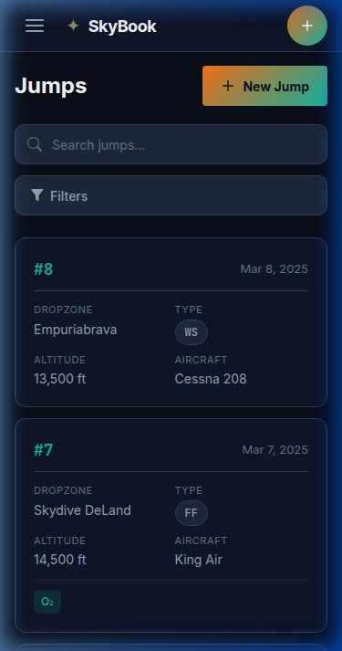

# 🪂 SkyBook

**A self-hosted skydive logbook.**

[](https://golang.org/)
[](LICENSE)

SkyBook is a lightning-fast, self-hosted web application for skydivers to log, search, and analyze their jump history from any device.



## ✨ Features (v1)

* **Single Binary Deployment**: The entire application (Go backend + built Vue SPA frontend) compiles into a single executable.
* **Zero Dependencies**: Uses an embedded SQLite database. No external database servers needed.
* **Mobile-First Design**: The responsive Vue 3 frontend works flawlessly on mobile devices and desktops alike.
* **Instant Search & Filter**: Find any jump by dropzone, aircraft, jump type, or free-text search.
* **Smart Autocomplete**: Dropzones, aircraft, and events autocomplete based on your jumping history.
* **Dark Mode**: Aviation-inspired dark theme optimized for readability in the sun or at the bonfire.
* **Multi-user Ready**: Designed with a multi-tenant foundation (single-user anonymous mode by default in v1).

## 🚀 Quick Start

The easiest way to run SkyBook is via Docker:

```bash
docker run -d \
  --name skybook \
  -p 8080:8080 \
  -v skybook-data:/data \
  ghcr.io/root-gg/skybook:latest
```

Then open `http://localhost:8080` in your browser.

*Note: Pre-compiled binaries will be available in the GitHub Releases page soon.*

## ⚙️ Configuration

SkyBook is configured via a TOML file (`skybook.cfg`) or environment variables.

By default, the application looks for `skybook.cfg` in the current directory. You can override this using the `--config` flag or the `SKYBOOK_CONFIG` environment variable.

All settings can be overridden using environment variables prefixed with `SKYBOOK_` (e.g., `SKYBOOK_DATABASE_PATH`).

For a complete list of configuration options, check the [default skybook.cfg](server/skybook.cfg) file.

## 🛠️ Building from Source

SkyBook uses `make` to orchestrate builds. You need **Go 1.22+** and **Node.js 20+**.

```bash
# Clone the repository
git clone https://github.com/root-gg/skybook.git
cd skybook

# Build the frontend (webapp) and backend (server)
make all

# The compiled binary will be in the server directory
./server/skybook
```

## 💻 Development

For active development, you can run the Vite development server and the Go backend concurrently:

```bash
make dev
```

This starts:
1. The **Go backend** on `http://localhost:8080`
2. The **Vite dev server** on `http://localhost:5173` (with hot-module reloading, automatically proxying `/api` requests to the Go backend)

Run tests formatting and linting:
```bash
make lint
make test          # Backend unit tests
make test-frontend # Frontend unit tests (Vitest)
make test-e2e      # E2E UI tests (Playwright)
```

## 🏗️ Architecture & Tech Stack

**Backend**:
* Go (Golang)
* `gorilla/mux` for routing
* `gorm` with SQLite driver for the database

**Frontend**:
* Vue 3 (Composition API)
* Vite
* Tailwind CSS 4
* Pinia (State Management)

For deeper technical context, system design, and AI agent workflows, see:
* [ARCHITECTURE.md](ARCHITECTURE.md) - System architecture and data models
* [AGENTS.md](AGENTS.md) - Context and workflows for AI Coding Assistants working on this repo

## 📄 License

This project is licensed under the MIT License - see the [LICENSE](LICENSE) file for details.
