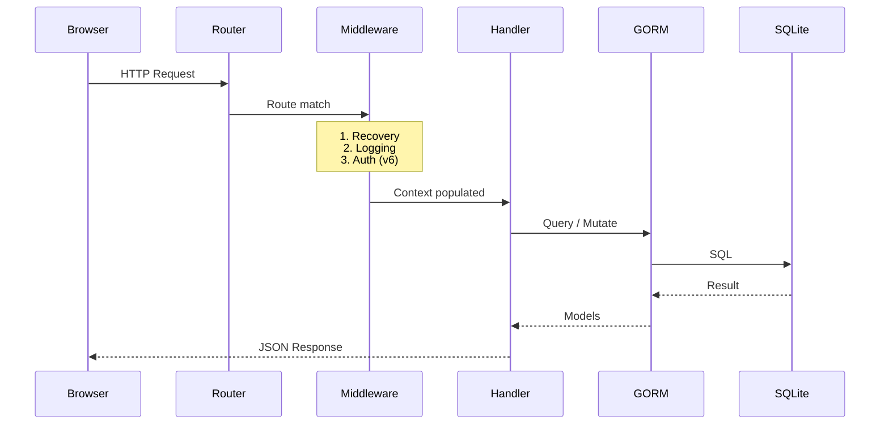

# SkyBook — Product Requirements Document

> A modern, self-hosted skydive logbook application.

---

## 1. Vision

SkyBook is a **personal skydive logbook** that lets skydivers log, search, and analyze their jump history from any device. It ships as a **single binary** (Go server + embedded Vue SPA) with an SQLite database — zero external dependencies, instant setup.

---

## 2. Tech Stack

| Layer | Technology | Notes |
|-------|-----------|-------|
| **Backend** | Go (net/http + gorilla/mux) | Plik-style layered packages |
| **ORM** | GORM + SQLite | WAL mode, `go:embed` migrations |
| **Frontend** | Vite 7 + Vue 3 + Tailwind CSS 4 | SPA embedded in Go binary via `embed.FS` at build time |
| **Build** | Makefile | `make all` = frontend build → Go build with embedded `webapp/dist/` |
| **Testing** | Go `testing` + Vitest + Playwright | Backend unit/integration, frontend unit, E2E |

### Package Layout (Plik-inspired)

```
skybook/
├── AGENTS.md
├── ARCHITECTURE.md
├── Makefile
├── go.mod / go.sum
├── server/
│   ├── main.go              ← entrypoint
│   ├── common/              ← shared types (Jump, User, Document, etc.), config
│   ├── metadata/            ← GORM backend, migrations, queries
│   ├── handlers/            ← HTTP handler functions
│   ├── middleware/           ← auth, logging, recovery, pagination
│   ├── server/              ← router setup, backend init, static file serving
│   └── cmd/                 ← cobra CLI (serve, migrate, import, export)
├── webapp/
│   ├── index.html
│   ├── vite.config.js
│   ├── package.json
│   ├── src/
│   │   ├── main.js
│   │   ├── App.vue
│   │   ├── router.js
│   │   ├── api.js           ← HTTP client for backend
│   │   ├── stores/          ← Pinia stores (jumps, auth, ui)
│   │   ├── components/      ← reusable UI components
│   │   ├── views/           ← page-level components
│   │   ├── locales/         ← i18n JSON files (v8)
│   │   └── style.css        ← Tailwind entry
│   └── dist/                ← build output, embedded by Go
└── docs/                    ← GitHub Pages (VitePress)
```

---

## 3. Data Model

### 3.1 Jump

The core entity. All jumps **must** remain ordered by `Number` at all times.

| Field | Type | Required | Description |
|-------|------|----------|-------------|
| `ID` | `uint` (PK) | auto | Internal database ID |
| `UserID` | `uint` (FK) | auto | Owner — anonymous user (ID=1) in v1, real user in v6 |
| `Number` | `uint` | ✅ | Sequential jump number (auto-assigned, recomputed on insert/delete) |
| `Date` | `datetime` | ✅ | Jump date and time |
| `Dropzone` | `string` | ✅ | Name of the dropzone (autocomplete from history) |
| `Aircraft` | `string` | – | Plane / aircraft type (autocomplete from history) |
| `JumpType` | `string` | ✅ | Discipline: `FF`, `WS`, `FS`, `CRW`, `HOP`, `CF`, `AFF`, `TANDEM`, `DEMO`, `XRW`, `ANGLE`, `TRACKING`, `CP`, `WINGSUIT`, `OTHER` |
| `Altitude` | `uint` | – | Exit altitude in feet |
| `DeployAltitude` | `uint` | – | Deployment altitude in feet |
| `FreefallTime` | `uint` | – | Freefall time in seconds |
| `CanopySize` | `uint` | – | Canopy size in sq ft |
| `LO` | `string` | – | Load Organizer or coach name (autocomplete) |
| `Event` | `string` | – | Event name — boogie, competition, course (autocomplete) |
| `Description` | `text` | – | Freeform notes / debrief |
| `Links` | `text (JSON)` | – | Array of URLs (video links, photos, etc.) |
| `Landing` | `string` | – | Landing quality: `Stand-up`, `Sliding`, `PLF`, `Off-DZ`, `Water` |
| `NightJump` | `bool` | – | Night jump flag |
| `OxygenJump` | `bool` | – | High-altitude O₂ jump |
| `CutAway` | `bool` | – | Cutaway / malfunction flag |
| `Wingsuit` | `bool` | – | Was a wingsuit flown? (Equipment system deferred to v11) |
| `Buddies` | `[]JumpBuddy` | – | People on the jump — shared buddy pool (v4) |
| `CreatedAt` | `datetime` | auto | |
| `UpdatedAt` | `datetime` | auto | |

> **Equipment / Gear system (v11):** Full gear tracking (canopy, harness, reserve, AAD, helmet, camera, suit, wingsuit) with a `Gear` table and `Kit` presets will be added in v11. For v1, only `Wingsuit bool` is tracked.

### 3.2 JumpBuddy (v4)

| Field | Type | Description |
|-------|------|-------------|
| `ID` | `uint` (PK) | |
| `Name` | `string` | Buddy name (autocomplete ranked by jump count together (popularity)) |

### 3.3 BaseJump (v9)

Separate table and webapp tab. Same numbering invariant as skydive jumps but independent sequence.

| Field | Type | Required | Description |
|-------|------|----------|-------------|
| `ID` | `uint` (PK) | auto | Internal database ID |
| `Number` | `uint` | ✅ | Sequential BASE jump number |
| `Date` | `datetime` | ✅ | Jump date and time |
| `Object` | `string` | ✅ | Object type: `BUILDING`, `ANTENNA`, `SPAN`, `EARTH`, `OTHER` |
| `Location` | `string` | ✅ | Site name / location |
| `Altitude` | `uint` | – | Exit altitude (feet above landing) |
| `Delay` | `uint` | – | Freefall delay in seconds |
| `Equipment` | `string` | – | Rig description |
| `PilotChute` | `string` | – | Pilot chute type / size |
| `Slider` | `string` | – | Slider config: `UP`, `DOWN`, `OFF`, `MESH` |
| `WingsuitFlown` | `bool` | – | Wingsuit BASE |
| `Tracking` | `bool` | – | Tracking jump |
| `Description` | `text` | – | Notes / debrief |
| `Links` | `text (JSON)` | – | Video / photo URLs |
| `Landing` | `string` | – | Landing quality |
| `CutAway` | `bool` | – | Cutaway / malfunction |
| `Buddies` | `[]JumpBuddy` | – | People on the jump (shared pool) |
| `CreatedAt` | `datetime` | auto | |
| `UpdatedAt` | `datetime` | auto | |

### 3.4 TunnelSession (v10)

Separate table and webapp tab. Numbered sequentially.

| Field | Type | Required | Description |
|-------|------|----------|-------------|
| `ID` | `uint` (PK) | auto | Internal database ID |
| `Number` | `uint` | ✅ | Sequential session number (same insert/delete renumbering as jumps) |
| `TotalTime` | `uint` | auto | Cumulative flight time in minutes (computed — equivalent of jump number for tunnel) |
| `Date` | `datetime` | ✅ | Session date |
| `Tunnel` | `string` | ✅ | Tunnel name / location (autocomplete) |
| `Duration` | `uint` | ✅ | Flight time in minutes |
| `Discipline` | `string` | – | `BELLY`, `BACK`, `SITFLY`, `HEADDOWN`, `VFS`, `DYNAMIC`, `FREESTYLE`, `HUCKJAM`, `OTHER` |
| `Coach` | `string` | – | Coach name |
| `Speed` | `uint` | – | Wind speed (mph / km/h) |
| `Description` | `text` | – | Notes / debrief |
| `Links` | `text (JSON)` | – | Video / photo URLs |
| `Buddies` | `[]JumpBuddy` | – | People in the session (shared pool) |
| `CreatedAt` | `datetime` | auto | |
| `UpdatedAt` | `datetime` | auto | |

### 3.5 Document (v3)

| Field | Type | Description |
|-------|------|-------------|
| `ID` | `uint` (PK) | |
| `Name` | `string` | Human label (e.g. "FAI License", "AAD Service Card") |
| `Type` | `string` | Category: `LICENSE`, `INSURANCE`, `RIG_CHECK`, `MEDICAL`, `AAD`, `RESERVE_REPACK`, `OTHER` |
| `FileName` | `string` | Original filename |
| `MimeType` | `string` | Content type |
| `Size` | `int64` | File size in bytes |
| `ExpiryDate` | `datetime` | Expiration / renewal date (optional, for reminders) |
| `Data` | `[]byte` | File content (stored in DB or on disk — TBD) |
| `CreatedAt` | `datetime` | |

### 3.6 User (v1 anonymous → v6 multi-tenant)

| Field | Type | Description |
|-------|------|-------------|
| `ID` | `uint` (PK) | |
| `Provider` | `string` | `local` / `google` |
| `ProviderID` | `string` | Provider-specific ID |
| `Email` | `string` | |
| `Name` | `string` | Display name |
| `Locale` | `string` | Preferred locale (v8) |
| `UnitSystem` | `string` | `imperial` / `metric` |
| `Weight` | `uint` | User body weight (optional, v13) |
| `GearWeight` | `uint` | Default gear weight (optional, v13) |
| `CreatedAt` | `datetime` | |
| `UpdatedAt` | `datetime` | |

### 3.7 Gear (v11)

| Field | Type | Description |
|-------|------|-------------|
| `ID` | `uint` (PK) | |
| `UserID` | `uint` (FK) | Owner |
| `Type` | `string` | `CANOPY`, `RESERVE`, `HARNESS`, `AAD`, `HELMET`, `ALTIMETER`, `JUMPSUIT`, `WINGSUIT`, `CAMERA`, `AUDIBLE`, `OTHER` |
| `Manufacturer` | `string` | |
| `Model` | `string` | |
| `Size` | `string` | e.g. "190", "M" |
| `Serial` | `string` | |
| `DOM` | `datetime` | Date of manufacture |
| `PurchaseDate` | `datetime` | |
| `PurchasePrice` | `uint` | Price paid in cents |
| `NextMaintenanceAt`| `datetime` | Next service date |
| `Notes` | `string` | |
| `Active` | `bool` | |
| `CreatedAt` | `datetime` | |
| `UpdatedAt` | `datetime` | |

### 3.8 Kit (v11)

A convenience grouping of Gear items that can be applied to a Jump.

| Field | Type | Description |
|-------|------|-------------|
| `ID` | `uint` (PK) | |
| `UserID` | `uint` (FK) | Owner |
| `Name` | `string` | Kit name |
| `GearItems`| `[]Gear` | Many-to-many via `kit_gear` |
| `CreatedAt` | `datetime` | |
| `UpdatedAt` | `datetime` | |

### 3.9 Dropzone (v12)

A globally shared canonical directory of dropzones.

| Field | Type | Description |
|-------|------|-------------|
| `ID` | `uint` (PK) | |
| `Name` | `string` | Canonical name |
| `Country` | `string` | ISO 3166-1 alpha-2 |
| `City` | `string` | Nearest city |
| `ICAO` | `string` | Airport code |
| `Latitude` | `float64` | GPS |
| `Longitude`| `float64` | GPS |
| `Website` | `string` | |
| `Email` | `string` | |
| `Phone` | `string` | |

### 3.10 ExitPoint (v12)

A globally shared canonical directory of BASE objects.

| Field | Type | Description |
|-------|------|-------------|
| `ID` | `uint` (PK) | |
| `Name` | `string` | Exit point name |
| `Object` | `string` | `BUILDING`, `ANTENNA`, `SPAN`, `EARTH`, `OTHER` |
| `Country` | `string` | ISO 3166-1 alpha-2 |
| `Region` | `string` | State/Province |
| `Latitude` | `float64` | GPS |
| `Longitude`| `float64` | GPS |
| `Notes` | `string` | Approach info, hazards |

### 3.11 WindTunnel (v12)

A globally shared canonical directory of wind tunnels.

| Field | Type | Description |
|-------|------|-------------|
| `ID` | `uint` (PK) | |
| `Name` | `string` | Wind tunnel name |
| `Country` | `string` | ISO 3166-1 alpha-2 |
| `City` | `string` | |
| `DiameterFt`| `uint` | Diameter in feet |
| `Website` | `string` | |
| `Email` | `string` | |
| `Phone` | `string` | |

---

## 4. Feature Roadmap

### v1 — Core Logbook

> Single-user, anonymous mode. No login required.

- **Jump CRUD**: Create, Read, Update, Delete jumps
- **Auto-numbering**: Jump numbers are always sequential. Inserting a jump between #50 and #51 renumbers all subsequent jumps. Deleting a jump renumbers downward
- **Jump list view**: Sortable, paginated table
- **Search & filters**: Filter by date range, dropzone, jump type, altitude range, keywords, and boolean flags (cutaway, night, etc.)
- **Autocomplete**: Dropzone, Aircraft, Equipment, and LO fields use historical values for autocomplete
- **Responsive**: Works on desktop and mobile
- **Dark mode**: Default dark theme with sky/aviation aesthetic

### v2 — Basic Statistics

- Total jumps, total freefall time
- Jumps per discipline (pie/bar chart)
- Jumps per dropzone (top 10)
- Jumps per month/year (timeline chart)
- Recent activity streak
- Average / max altitude
- Cutaway count

### v3 — Document Storage

- Upload and store documents (PDF, images)
- Document categories: License, Insurance, Rig Check, Medical, AAD Service, Reserve Repack
- Expiry date tracking with visual warnings (expired = red, expiring soon = amber)
- View / download documents inline
- File size limits (configurable)

### v4 — Jump Buddies

- Add buddies to each jump
- Autocomplete ranked by jump count together (popularity)
- "Buddy leaderboard" — who you jump with most
- Quick-add recent buddies

### v5 — Import / Export

- **Export**: Full logbook as JSON (all jumps, documents metadata, buddies)
- **Import**: JSON import with conflict resolution (merge / overwrite / skip)
- Progress indicator for large imports
- Schema versioning for forward compatibility

### v6 — Multi-Tenant + Google Login

- User accounts with Google OAuth 2.0
- Each user has their own isolated logbook
- Session management (JWT cookies, Plik-style)
- Anonymous mode remains as default for self-hosters who don't configure auth
- User settings (unit system, defaults)

### v7 — Advanced Statistics

- Interactive charts (Chart.js / ApexCharts)
- Progression curves (jumps over time, freefall time growth)
- Equipment usage tracking (jumps per rig)
- Currency tracker (jumps in last 30/60/90 days, FAA currency rules)
- Heatmap calendar (GitHub-style contribution graph)
- Personal records (highest altitude, longest freefall)
- Dropzone map (if coordinates are stored)

### v8 — Internationalization

- vue-i18n integration
- Language files: English (default), French, Spanish, German, and more
- User-selectable locale (stored in user preferences)
- Number / date formatting per locale
- Unit system (feet/meters, knots/km/h) tied to locale or user preference

### v9 — BASE Jump Logbook

- Separate "BASE" tab in the webapp
- Independent jump numbering sequence
- Object-type classification (B.A.S.E.)
- BASE-specific fields: slider config, pilot chute, delay
- Same CRUD, search, filter, and auto-numbering patterns as skydive jumps
- Shared buddies pool (v4) across skydive and BASE

### v10 — Tunnel Time Tracker

- Separate "Tunnel" tab in the webapp
- Track flight sessions with duration, discipline, wind speed
- Cumulative tunnel time statistics
- Coach tracking with autocomplete
- Same CRUD and search patterns as jump tables

---

## 5. Architecture

### 5.1 Request Flow



### 5.2 Jump Number Invariant

**Rule**: Jump numbers form a contiguous 1-based sequence. No gaps, no duplicates.

| Operation | Behavior |
|-----------|----------|
| **Create** (append) | `Number = MAX(Number) + 1` |
| **Insert** at position N | Shift all jumps with `Number >= N` up by 1, then insert at N |
| **Delete** jump N | Remove jump, shift all jumps with `Number > N` down by 1 |
| **Bulk import** | Disable auto-numbering, assign final numbers, validate contiguity |

This is implemented as a **database transaction** to ensure atomicity.

### 5.3 API Design (v1)

All endpoints prefixed with `/api/v1`.

| Method | Path | Description |
|--------|------|-------------|
| `GET` | `/api/v1/jumps` | List jumps (paginated, filterable, sortable) |
| `POST` | `/api/v1/jumps` | Create jump (append or insert at position) |
| `GET` | `/api/v1/jumps/:id` | Get single jump |
| `PUT` | `/api/v1/jumps/:id` | Update jump |
| `DELETE` | `/api/v1/jumps/:id` | Delete jump (triggers renumber) |
| `GET` | `/api/v1/jumps/autocomplete/:field` | Autocomplete values for a field |
| `GET` | `/api/v1/stats` | Statistics (v2+) |
| `GET` | `/api/v1/documents` | List documents (v3) |
| `POST` | `/api/v1/documents` | Upload document (v3) |
| `GET` | `/api/v1/documents/:id` | Download document (v3) |
| `DELETE` | `/api/v1/documents/:id` | Delete document (v3) |
| `GET` | `/api/v1/buddies` | List buddies with popularity (v4) |
| `POST` | `/api/v1/export` | Export logbook as JSON (v5) |
| `POST` | `/api/v1/import` | Import logbook from JSON (v5) |
| `GET` | `/api/v1/config` | Server configuration (feature flags) |

#### Query Parameters for `GET /api/v1/jumps`

| Param | Type | Description |
|-------|------|-------------|
| `page` | int | Page number (1-based) |
| `per_page` | int | Results per page (default 25, max 100) |
| `sort` | string | Sort field: `number`, `date`, `dropzone`, `altitude` |
| `order` | string | `asc` / `desc` (default: `desc` by number) |
| `q` | string | Full-text search across description, dropzone, event |
| `date_from` | date | Start date filter |
| `date_to` | date | End date filter |
| `dropzone` | string | Exact dropzone filter |
| `jump_type` | string | Filter by discipline |
| `altitude_min` | int | Minimum altitude |
| `altitude_max` | int | Maximum altitude |
| `cutaway` | bool | Filter cutaway jumps |
| `night` | bool | Filter night jumps |
| `lo` | string | Filter by Load Organizer / Coach |

### 5.4 Webapp Embedding

The frontend is built with `npm run build` into `webapp/dist/`. The Go server embeds it via `embed.FS`:

```go
//go:embed all:dist
var webappFS embed.FS

// Serve SPA — all non-API routes fall through to index.html
func serveSPA(router *mux.Router) {
    distFS, _ := fs.Sub(webappFS, "dist")
    fileServer := http.FileServer(http.FS(distFS))
    router.PathPrefix("/").Handler(spaHandler(fileServer))
}
```

### 5.5 Build Pipeline

```
make all
  ├── make frontend      → cd webapp && npm ci && npm run build
  └── make server        → go build (embeds webapp/dist/)

make dev
  ├── webapp: vite dev server on :5173 (proxies /api/* to :8080)
  └── server: go run on :8080
```

---

## 6. UI / UX Design Principles

- **Dark-first**: Deep navy / charcoal base with sky-gradient accents (sunset orange → teal)
- **Aviation aesthetic**: Subtle cloud/altimeter iconography, monospace numbers for jump counts
- **Fully responsive**: The mobile experience must be at least as good as desktop. Requirements:
  - Touch targets ≥ 44×44 px
  - `<meta name="viewport" content="width=device-width, initial-scale=1">` in `index.html`
  - No hover-only interactions — all hover states must have touch/tap equivalents
  - Tables switch to card layout on `< 640px`
  - Modals become full-screen sheets on mobile
  - All features must be fully usable on a 375px-wide screen (iPhone SE)
- **Micro-animations**: Smooth row insertions, number counter animations, filter transitions
- **Quick entry**: Jump form optimized for speed — smart defaults, autocomplete everywhere
- **Keyboard shortcuts**: `N` for new jump, `/` for search focus, `Esc` to close modals (desktop only, hidden on mobile)

---

## 7. Configuration

TOML config file (`skybook.cfg`), overridable by env vars with `SKYBOOK_` prefix (Plik pattern):

```toml
[server]
ListenAddress = "0.0.0.0"
ListenPort = 8080
Debug = false

[database]
# SQLite database path
Path = "./skybook.db"

[auth]
# "anonymous" (v1 default) or "google"
Provider = "anonymous"
# Google OAuth (v6)
GoogleClientID = ""
GoogleClientSecret = ""

[storage]
# Max document file size (v3)
MaxDocumentSize = "10MB"
# Storage path for documents (alternative to in-DB)
DocumentPath = "./documents"

[defaults]
# Default unit system: "imperial" or "metric"
UnitSystem = "imperial"
# Default jump type
DefaultJumpType = "FF"
```

---

## 8. Non-Functional Requirements

| Aspect | Requirement |
|--------|-------------|
| **Single binary** | One `skybook` executable, no external runtime deps |
| **SQLite** | WAL mode, single-writer, zero-config |
| **Startup** | < 1s cold start |
| **Logbook size** | Support 10,000+ jumps with sub-100ms query times |
| **Docker** | Dockerfile with multi-stage build (node → go → scratch/alpine) |
| **Backup** | SQLite file copy is a valid backup strategy |
| **Offline-ready** | SPA loads fully, works without internet (future PWA) |

---

## 9. Multi-Tenant Readiness (v1 Architecture Decisions)

Even in v1 (anonymous/single-user), the data model includes a `UserID` foreign key on all user-scoped tables (jumps, documents). In v1, a default "anonymous" user (ID=1) is auto-created and all data is attributed to it. This ensures:

- Zero schema changes when v6 adds authentication
- Clean data isolation from day one
- No migration headaches

---

## 10. Future Considerations (Beyond v10)

### Planned Milestones

| Version | Feature | Status |
|---------|---------|--------|
| **v11** | **Gear & Kit Tracking** — `Gear` table with type, model, size, DOM, purchase price, maintenance date; `Kit` shortcuts; jump linkage via `jump_gear`. | Planned |
| **v12** | **Location Directory** — Shared directory replacing strings. Three separated models: `Dropzone` (jumps), `ExitPoint` (BASE), `WindTunnel` (tunnel sessions). Includes seed community data. | Planned |
| **v13** | **Wingloading Calculator** — Webapp utility computing `lbs/sqft` based on jumper/gear weight and canopy size. | Planned |
| **v14** | **PWA & Offline Access** — Service worker for offline jump logging and viewing. Syncs with backend when connection is restored. Installable as mobile app. | Planned |

### Longer-Term Ideas

- **Mobile app**: Capacitor wrapper for iOS/Android
- **Altimeter integration**: Import data from FlySight, Dekunu, L&B devices
- **License tracking**: FAA/USPA license progression visualisation
- **Social features**: Share jump logs, public profiles
- **Webhook / API keys**: Integration with third-party services
