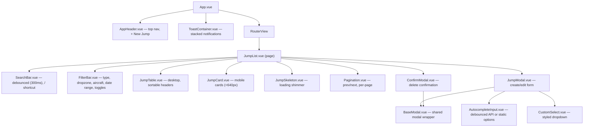

# Architecture — Webapp (`webapp/`)

> Internals of the SkyBook Vue 3 SPA. For system-wide overview, data model, and API reference, see the root [ARCHITECTURE.md](../ARCHITECTURE.md).

---

## Tech Stack

| Layer | Tech |
|-------|------|
| Framework | Vue 3, Composition API, `<script setup>` |
| State | Pinia |
| Router | Vue Router 4, HTML5 history mode |
| Styling | Tailwind CSS 4 with `@theme` customization + `@utility` blocks |
| Build | Vite 7 |
| HTTP | `fetch()` via centralized `api.js` client |

---

## Design System

### Aesthetic Rationale

SkyBook uses a **dark-first, aviation-inspired** aesthetic to match the skydiving domain:

- **Base**: Deep navy/charcoal (`#0f172a` → `#1e293b`) — reduces eye strain during field use
- **Accent gradient**: Sunset orange (`#f97316`) → Teal (`#14b8a6`) — evokes sky/dusk imagery
- **Typography**: Inter (body), JetBrains Mono (numbers/monospace) — loaded via Google Fonts
- **Micro-animations**: Row insertions, number counters, filter transitions — add life without hindering usability

### Custom CSS Utilities (`style.css`)

Defined via Tailwind v4 `@utility` syntax:

| Utility | Purpose |
|---------|---------|
| `glass-card` | Semi-transparent card with `backdrop-blur` |
| `btn`, `btn-primary`, `btn-danger`, `btn-ghost` | Button variants |
| `input-field` | Styled text input |
| `toggle-switch` / `toggle-dot` | Animated toggle |

> [!NOTE]
> These are `@utility` blocks, NOT traditional CSS classes or `@apply`. They follow Tailwind v4's custom utility syntax and generate single-class utilities.

---

## Routing & URL Sync

Uses `createWebHistory()` (HTML5 history, no hash):

| Route | View | Description |
|-------|------|-------------|
| `/` | JumpList | Main logbook (default) |
| `/stats` | Statistics | Dashboard (v2+) |
| `/documents` | Documents | Document storage (v3+) |
| `/base` | BaseJumpList | BASE logbook (v9) |
| `/tunnel` | TunnelList | Tunnel sessions (v10) |
| `/settings` | Settings | User preferences (v6+) |

### URL ↔ Store Sync Strategy

Query parameters and store state are synchronized bidirectionally:

1. **On mount**: read `route.query` → populate store (sort, page, filters)
2. **On store change**: write store → `router.replace()` (avoids history clutter)

> [!CAUTION]
> Use `router.replace()` for filter/sort changes (avoids cluttering browser history). Use `router.push()` only for page-level navigation where back/forward should work.

---

## Component Hierarchy

---

## Jump List — View/Store Interaction

### State Management (`stores/jumps.js`)

Pinia store managing:
- `items` — current page of jumps
- `totalItems` / `currentPage` / `perPage` — pagination state
- `sortBy` / `sortOrder` — column sort
- `filters` — active filter values (search query, date range, dropzone, etc.)

**Mutation actions**: `createJump`, `updateJump`, `deleteJump` — all call the API then trigger a full `fetchJumps()` refresh. This is intentional: auto-renumbering means the server is the only source of truth for jump numbers after any mutation.

> [!IMPORTANT]
> Never optimistically update jump numbers client-side. The server may renumber multiple jumps (e.g., insert at position triggers a shift). Always refetch after mutations.

### Layout Switching

`JumpList.vue` uses a reactive breakpoint to switch between:
- `JumpTable` (desktop, `≥640px`) — sortable column headers, row click → edit
- `JumpCard` (mobile, `<640px`) — 2-column grid cards, card click → edit

---

## Jump Form — Modal Lifecycle

### Trigger Flow

`JumpList` maintains `showModal: ref(bool)` and `editingJump: ref(jump|null)`:

| Action | Trigger | Mode |
|--------|---------|------|
| Click `+ New Jump` header button | or press `N` key | Create (null jump) |
| Click table row / card | | Edit (pre-populated jump) |

The `N` shortcut is registered globally on `window` in `onMounted` and cleaned up in `onUnmounted`.

### BaseModal Pattern

`BaseModal.vue` is the shared modal wrapper used by both `JumpModal` and `ConfirmModal`:
- Teleports to `<body>`
- Backdrop overlay with click-outside-to-close
- `Escape` key dismissal
- Configurable `z-index` prop
- Full-screen sheet on mobile `<640px`

### AutocompleteInput

Dual-mode combobox — API-backed or static options:

| Mode | When | Behavior |
|------|------|----------|
| **API** | `options` prop absent | Debounced (200ms) fetch to `/api/v1/jumps/autocomplete/:field`; shows all on empty focus, filtered matches on type |
| **Static** | `options` prop provided | Client-side prefix filter on the given array; no API call. Used by altitude, landing, and pattern fields. |

Both modes share identical keyboard behavior (↑/↓/Enter/Escape) and touch targets (min 44px).

The `inputmode` prop is passed through to `<input>` for mobile keyboard control (e.g. `inputmode="numeric"` shows the numeric keypad while keeping `type="text"` for autocomplete compatibility).

Populates: dropzone, aircraft, altitude (static), landing (static), pattern (static), event, LO fields.

---

## API Client (`api.js`)

Centralized `fetch()` wrapper:

- **Base URL**: `/api/v1` (hardcoded)
- **JSON handling**: auto-sets `Content-Type`, auto-parses response
- **Error shape**: throws `Error` with `.status` and `.body` properties for structured handling
- **204 handling**: returns `null` for No Content responses

### Dev Proxy

In development, Vite proxies `/api/*` to `localhost:8080` (configured in `vite.config.js`). The SPA runs on `:5173`, the Go server on `:8080`.

> [!NOTE]
> The proxy only applies in dev mode. In production, the SPA is embedded in the Go binary and shares the same origin — no proxy needed.

---

## Toast Notifications

`stores/toast.js` + `ToastContainer.vue` provide non-blocking user feedback:

- `addToast({ message, type, duration })` — pushes a notification
- Types: `success`, `error`, `info`
- Auto-dismiss after configurable duration (default 5s)
- Stacked from bottom-right with enter/leave transitions

---

## Gotchas & Invariants

### Date Display

The API returns `"YYYY-MM-DD"` strings. The webapp displays them as-is — no timezone conversion, no locale-specific formatting. This is intentional: skydiving logbooks use the date at the dropzone, not the user's browser timezone.

### Filter Persistence

FilterBar collapses on mobile. Filter state is persisted in the URL query string via `toQuery()` / `initFromQuery()` in `stores/jumps.js`. All active filters survive a page refresh and can be bookmarked or shared. Filters are stored in the Pinia store in-memory — navigating away and back (within the SPA) also preserves filter state via URL sync.

### Delete Confirmation

Deleting a jump renumbers all subsequent jumps. The `ConfirmModal` explicitly warns about this. The store always refetches after delete to get the renumbered data.

---

## Testing

### Unit Tests (`make test-frontend`)

Uses **Vitest** with `@vue/test-utils` and **jsdom**:

| File | What's tested |
|------|--------------|
| `stores/jumps.spec.js` | State init, CRUD actions, sorting, filtering, pagination, URL sync |
| `stores/toast.spec.js` | Toast adding, auto-dismiss, type handling |
| `components/AutocompleteInput.spec.js` | Rendering, v-model, debounced API calls, keyboard nav, static options mode |
| `components/BaseModal.spec.js` | Open/close, click-outside, Escape key, Teleport |
| `components/CustomSelect.spec.js` | Rendering, selection, keyboard nav, search |
| `components/Pagination.spec.js` | Page range display, prev/next disabled states, per-page switching |

Vitest is scoped to `src/**/*.spec.js` (in `vite.config.js`) to avoid picking up Playwright E2E files.

### E2E Tests (`make test-e2e`)

Uses **Playwright** against a live full stack (Go backend + Vite dev server).

`playwright.config.js` `webServer` block auto-boots:
1. Go backend on `:8080` with `SKYBOOK_DATABASE_PATH=:memory:` for isolation
2. Vite dev server on `:5173` (proxies `/api` → `:8080`)

| File | What's tested |
|------|--------------|
| `e2e/jumps.spec.js` | Jump CRUD (create, edit, delete, insert-at, search/filter) |
| `e2e/mobile.spec.js` | Responsive layout, touch targets ≥44px, modal usability at 375px |

Projects: **Desktop Chrome** and **Mobile Safari (iPhone SE)**. All interactable elements have `data-testid` attributes.
